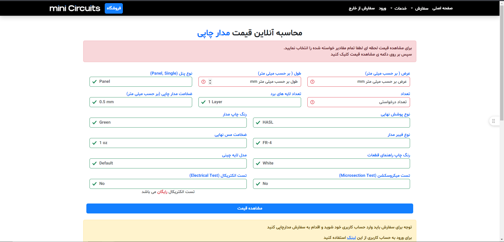
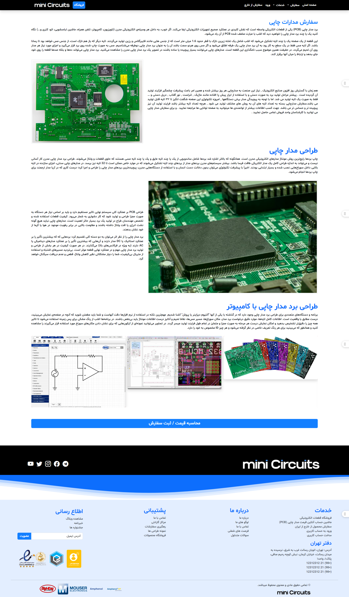
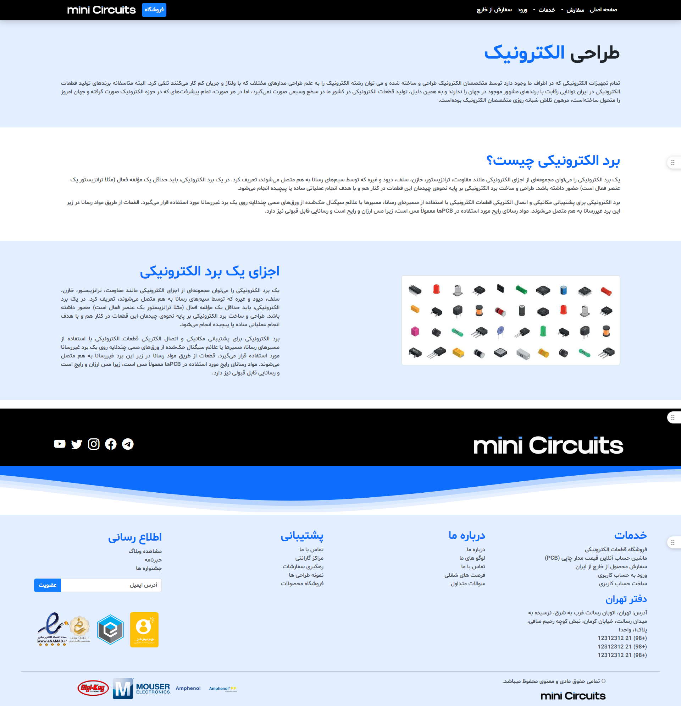
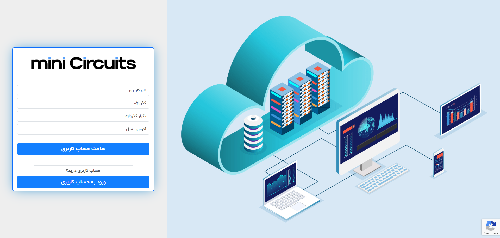

# Clone of MiniCircuits

 
 

## 🚀Demo image

## 🔥 tech stack

- Python3
- Flask
  - Flask-Captcha2
  - Flask-Session
  - Flask-sqlalchemy
  - Flask-Wtf
  - Flask-migrate
  - Flask-Bable
  - Flask-Mail
- Celery
- Redis
- Mysql
- Html/css
- Javascript
- Moment js
- Jquery
- Owl carousel
- Bootstrap 5.2

## 🚧 How to run

    python -m venv venv

    